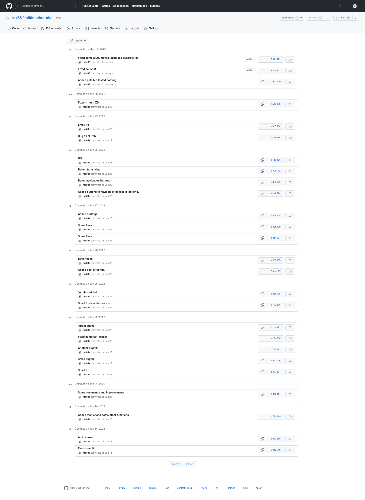

# mibimarket
A small discord bot similar to dank memer

## About

### Why did I made this bot?

I found dank memer really fun, but I found it annoying that you just can't stop playing, for example, if you don't want to loose your pet, and if want to stop playing for some time you need to pay (/vacation). That's really annoying. So I started coding my own bot, that is less adictive. I know the code is really dirty, but I don't want to spend a lot of time coding it.

### Early developement

I started coding this in january 2023 and threw everything in a repo, with the token, the data and unused files.

So I decided today to publish the source code and for each commit I made a commit in this repo. If you are curious and want to know a bit more about the original commits :

## Starting the bot

This bot requires interactions.py 5

Put your token in bot_token.py and then you just need to start the bot !

I hope that you will have fun playing with it !
